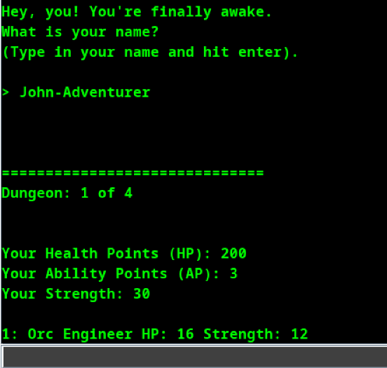

# Dungeons & Dungeons & Dungeons

[Play in Browser](https://ckendrick-mqu.itch.io/dungeons) | [Download Latest Build](https://github.com/c-kendrick/COMP1010/releases/tag/Main-jar)

A Java command-line tactical RPG that implements scalable Object-Oriented Programming (OOP) architecture, algorithmic combat logic, and data persistence. The turn-based system is structured for extensibility, allowing new entity types and mechanics to be integrated without modifying core control flows.

---

## Core Mechanics & Features

* **Initialisation:** Players select difficulty parameters and instantiate a specific class object, which dictates their base stats and available methods.
* **Combat State Loop:** Battles operate on a strict turn-based loop. Each turn, players manage Ability Points (AP) and Health Points (HP) to perform standard attacks or trigger class-specific abilities. 
* **Dynamic Progression:** As the application generates sequential dungeon levels, players accumulate gold and equipment objects. Resting restores state variables (HP and AP).
* **Data Aggregation:** Players can equip up to four items at once, which the system aggregates to calculate final stat bonuses.
* **Algorithmic Tactics:**
  * **Class Subsystems:** Each class executes unique backend mechanics (e.g., state-toggles like invisibility for the Rogue, resource-building for the Engineer, and specific spell interactions for the Mage).
  * **Race Multipliers:** Combat output calculations are heavily influenced by a matrix-style race advantage system, dynamically altering damage variables based on entity properties.

---

## Setup & Execution

1. [Download and run the latest .jar build](https://github.com/c-kendrick/COMP1010/releases/tag/Main-jar) or [play it directly in your browser](https://ckendrick-mqu.itch.io/dungeons).
2. Click into the console input section at the bottom, type numbers to make your menu choices, and press `Enter`.
3. **First-time recommendation:** Select Normal difficulty (Option 2) and the Barbarian class (Option 1) for a standard application flow. Feel free to experiment.

---

## Technical Notes & Design Choices

The architecture is structured for extensibility, allowing new classes, races, or items to be integrated without refactoring the main application loop.

* **Object-Oriented Architecture:** Utilises inheritance to share core fields and behaviour in a base `Character` class, with subclassing to handle class-specific stats and unique abilities.
* **Polymorphic Combat Structure:** The `Dungeon` class utilises a recursive structure that holds an `ArrayList` of enemy `Character` objects. This allows the core combat logic to iterate through and interact with all entities uniformly, regardless of their specific subclass.
* **Data Persistence:** Equipment generation and inventory state write directly to a CSV file to handle local data persistence and end-of-run reporting.
  
---

## Credits

* **Development Team:** Christopher Kendrick, Leif Varapuzhakaran, Ken Armstrong, Max Patel
